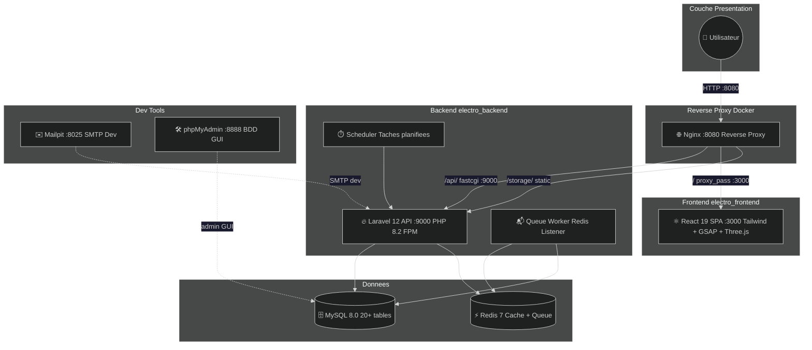
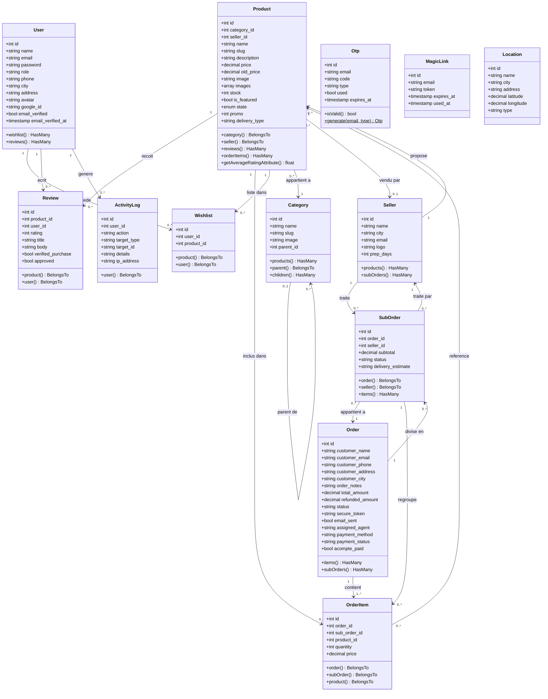
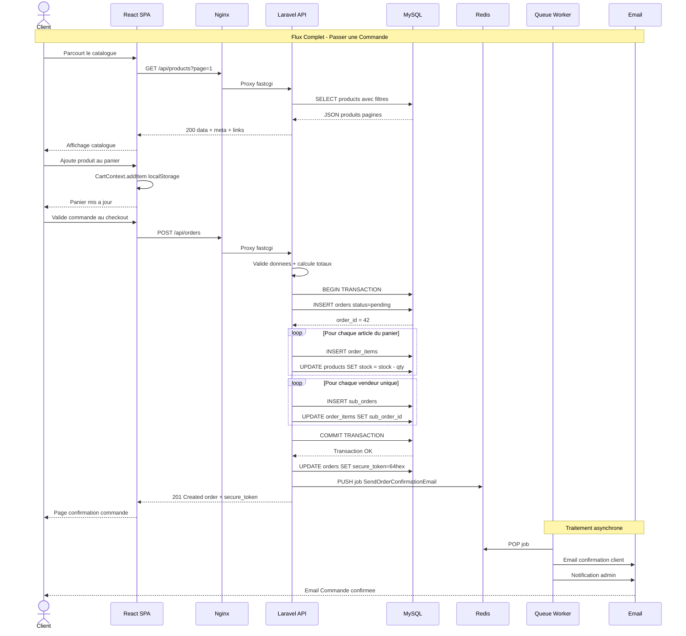
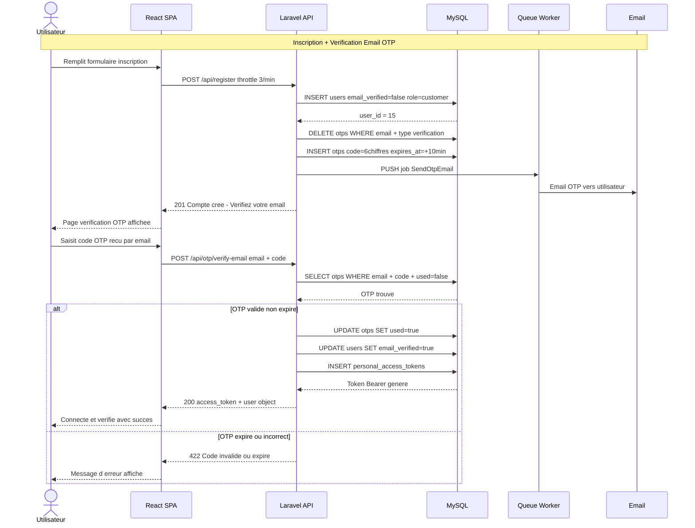
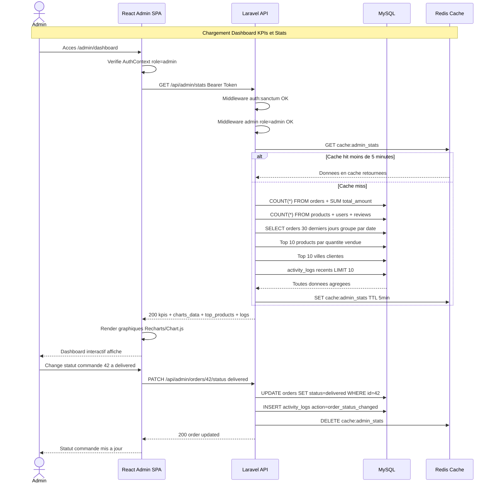
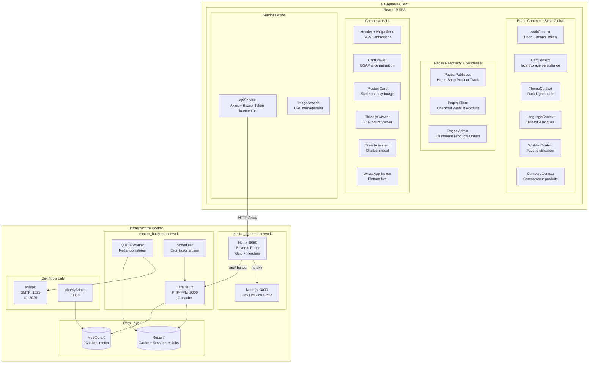
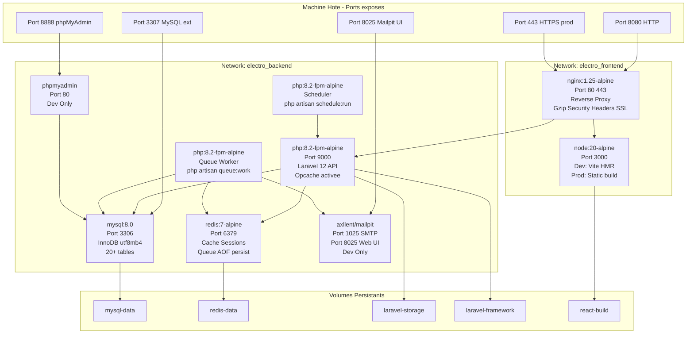
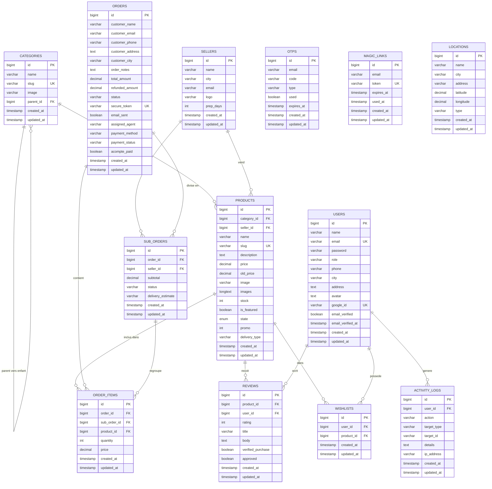

<div align="center">


<br/>


<br/><br/>


</div>

---

## 📑 Table des Matières

1. [Présentation du Projet](#-présentation-du-projet)
2. [Fonctionnalités Principales](#-fonctionnalités-principales)
3. [Architecture Globale](#️-architecture-globale)
4. [Stack Technologique](#️-stack-technologique)
5. [Structure du Projet](#️-structure-du-projet)
6. [Modèles & Base de Données](#️-modèles--base-de-données)
7. [API REST – Endpoints Complets](#-api-rest--endpoints-complets)
8. [Authentification](#-authentification-multi-méthodes)
9. [Modules Fonctionnels](#-modules-fonctionnels)
10. [Diagrammes UML](#-diagrammes-uml)
11. [Notifications Email](#-notifications-email)
12. [Sécurité](#-sécurité)
13. [Performance](#-performance)
14. [Installation & Déploiement](#-installation--déploiement-docker)
15. [Données de Seed](#-données-de-seed)
16. [Pages Frontend](#️-pages-frontend)
17. [Améliorations Futures](#-améliorations-futures)
18. [Auteur](#-auteur)

---

## 🧠 Présentation du Projet


**Electro-05** est une plateforme **E-commerce B2C** construite selon une **architecture Headless** avec conteneurisation **Docker** complète.

Le frontend React est totalement découplé du backend Laravel, garantissant **performance, sécurité et évolutivité**.

> 💡 Conçu pour le marché marocain, ce projet propose une expérience d'achat moderne en 4 langues (fr, en, ar, es) avec un système multi-vendeurs intégré et une **visionneuse 3D** des produits (Three.js).

<br clear="right"/>

---

## ✨ Fonctionnalités Principales

<div align="center">

</div>

| Catégorie | Fonctionnalité |
|-----------|---------------|
| 🛍️ **Catalogue** | Produits dynamiques avec filtres multi-critères (prix, marque, état, promo, stock) |
| 🛒 **Panier** | Panier client-side (localStorage) avec persistance navigateur |
| 🔐 **Auth** | 4 méthodes : Email/Password, Google OAuth, Magic Link, OTP |
| 📦 **Commandes** | Création, suivi par token sécurisé, sous-commandes par vendeur |
| 💳 **Paiement** | Paiement virtuel CB avec validation Luhn + facture PDF |
| 🧑‍💼 **Admin** | Dashboard KPIs, graphiques, CRUD produits/catégories, exports CSV/XLSX |
| 🤖 **Assistant** | Chatbot guide d'achat par questions/réponses |
| 🌍 **i18n** | 4 langues (Français, English, العربية, Español) avec support RTL |
| 🎨 **UI/UX** | Thème Dark/Light, animations GSAP, **visionneuse 3D (Three.js)** |
| 🧩 **Multi-vendeurs** | Découpage automatique des commandes par vendeur |
| 📧 **Emails** | 10+ templates transactionnels (OTP, confirmation, facture, contact…) |
| 🐳 **Docker** | Déploiement automatisé avec 9 conteneurs orchestrés |
| ❤️ **Wishlist** | Favoris utilisateur avec toggle + liste dédiée |
| ⚖️ **Comparateur** | Comparaison jusqu'à 3 produits en tableau |
| ⭐ **Avis** | Système de notes 1-5 étoiles avec modération admin |
| 📍 **Carte** | 8 localisations (agences + points relais) sur carte interactive |
| 📄 **PDF** | Génération de reçus/factures PDF via DomPDF |
| 🔔 **Notifications** | Emails transactionnels asynchrones via Redis Queue Worker |

---

## 🏗️ Architecture Globale



**9 conteneurs orchestrés :** `nginx` · `react` · `laravel` · `mysql` · `redis` · `phpmyadmin` · `queue-worker` · `scheduler` · `mailpit`

---

## ⚙️ Stack Technologique

<div align="center">

### 🎨 Frontend


### 🔧 Backend


### 🐳 Infrastructure


</div>

### 🎨 Frontend

| Technologie | Version | Rôle |
|-------------|---------|------|
| **React.js** | 19 | SPA avec code-splitting et lazy loading |
| **Tailwind CSS** | 3 | UI moderne et responsive |
| **GSAP** | 3 | Animations premium (drawer, mega menu) |
| **Three.js** | latest | Visionneuse 3D produits |
| **i18next** | latest | Internationalisation 4 langues avec RTL |
| **Axios** | latest | Communication API REST |
| **React Context** | – | État global (Auth, Cart, Compare, Theme, Wishlist, Lang) |
| **ExcelJS** | latest | Export XLSX côté client |

### 🔧 Backend

| Technologie | Version | Rôle |
|-------------|---------|------|
| **Laravel** | 12 | API REST principale |
| **PHP** | 8.2 FPM | Runtime optimisé Alpine |
| **Laravel Sanctum** | – | Authentification par tokens Bearer |
| **MySQL** | 8.0 | Base de données relationnelle (20+ tables) |
| **Redis** | 7 | Cache, sessions, files d'attente |
| **DomPDF** | latest | Génération factures/reçus PDF |
| **Maatwebsite/Excel** | latest | Export CSV/XLSX serveur |
| **Mailpit** | latest | SMTP de développement |

### 🐳 Infrastructure Docker

| Service | Image | Port | Rôle |
|---------|-------|------|------|
| **nginx** | nginx:1.25-alpine | 8080:80, 443:443 | Reverse proxy unique |
| **react** | node:20-alpine | 3000 | SPA HMR (dev) / Build statique (prod) |
| **laravel** | php:8.2-fpm-alpine | 9000 | API PHP-FPM |
| **mysql** | mysql:8.0 | 3307:3306 | Base de données |
| **redis** | redis:7-alpine | 6379 | Cache + Queue + Sessions |
| **phpmyadmin** | phpmyadmin:latest | 8888:80 | Gestion BDD (dev) |
| **queue-worker** | php:8.2-fpm-alpine | – | File d'attente Redis |
| **scheduler** | php:8.2-fpm-alpine | – | Tâches planifiées Laravel |
| **mailpit** | axllent/mailpit | 8025:8025, 1025:1025 | SMTP dev |

---

## 🗂️ Structure du Projet

```
05-Electro-profesionnels/
│
├── README.md                     <- Ce fichier
├── Functional_Specification.md   <- Cahier des charges
├── PROJET_DOCUMENTATION.md       <- Documentation technique
├── Requete-SQL.txt               <- Requetes SQL utiles
├── .env                          <- Variables d'environnement
│
├── Back-end/                     <- API Laravel 12
│   ├── app/
│   │   ├── Http/
│   │   │   ├── Controllers/      <- 16 controleurs REST
│   │   │   │   ├── AuthController.php
│   │   │   │   ├── ProductController.php
│   │   │   │   ├── OrderController.php
│   │   │   │   ├── CategoryController.php
│   │   │   │   ├── DashboardController.php
│   │   │   │   ├── ReviewController.php
│   │   │   │   ├── WishlistController.php
│   │   │   │   ├── ContactController.php
│   │   │   │   ├── OtpController.php
│   │   │   │   ├── MagicLinkController.php
│   │   │   │   ├── GoogleAuthController.php
│   │   │   │   ├── PaymentController.php
│   │   │   │   ├── ReceiptController.php
│   │   │   │   ├── InvoiceController.php
│   │   │   │   └── LocationController.php
│   │   │   └── Middleware/
│   │   │       ├── AdminMiddleware.php
│   │   │       ├── EmailVerifiedMiddleware.php
│   │   │       └── SetLocale.php
│   │   ├── Models/               <- 13 modeles Eloquent
│   │   ├── Mail/                 <- Classes Mailable
│   │   ├── Observers/            <- ProductObserver
│   │   └── Exports/              <- Classes export
│   ├── database/
│   │   ├── migrations/           <- 20 migrations
│   │   └── seeders/              <- 9 seeders
│   ├── resources/views/
│   │   ├── emails/               <- 10 templates email Blade
│   │   └── pdf/                  <- Templates facture PDF
│   └── routes/
│       ├── api.php               <- 50+ endpoints REST
│       └── web.php
│
├── Frond-end/test/               <- React 19 SPA
│   └── src/
│       ├── components/           <- Atoms / Molecules / Organisms
│       ├── contexts/             <- 6 contextes React
│       │   ├── AuthContext.jsx
│       │   ├── CartContext.jsx
│       │   ├── CompareContext.jsx
│       │   ├── LanguageContext.jsx
│       │   ├── ThemeContext.jsx
│       │   └── WishlistContext.jsx
│       ├── pages/                <- 30 pages (public / client / admin)
│       ├── services/             <- Couche API Axios
│       ├── locales/              <- fr, en, ar, es (500+ cles)
│       └── layouts/              <- MainLayout, AdminLayout
│
└── docker/                       <- Infrastructure complete
    ├── docker-compose.yml
    ├── docker-compose.override.yml
    ├── docker-compose.prod.yml
    ├── nginx/
    ├── laravel/
    ├── react/
    ├── mysql/
    └── scripts/
```

---

## 🗄️ Modèles & Base de Données

### Tables Métier (13 tables)

| Table | Rôle | Clés étrangères |
|-------|------|-----------------|
| `users` | Comptes clients + admin | – |
| `categories` | Arborescence hiérarchique 3 niveaux | `parent_id → categories.id` |
| `sellers` | Vendeurs/préparateurs multi-vendor | – |
| `products` | Catalogue avec images JSON, état, promo | `category_id, seller_id` |
| `orders` | Commandes clients avec token sécurisé | – |
| `order_items` | Articles d'une commande (prix figé) | `order_id, product_id, sub_order_id` |
| `sub_orders` | Sous-commandes découpées par vendeur | `order_id, seller_id` |
| `reviews` | Avis clients 1-5 étoiles avec modération | `product_id, user_id` |
| `wishlists` | Favoris utilisateurs | `user_id, product_id` |
| `otps` | Codes OTP 6 chiffres (vérification + reset) | `email` |
| `magic_links` | Tokens connexion sans mot de passe SHA256 | `email` |
| `locations` | Agences et points relais avec lat/lng | – |
| `activity_logs` | Journalisation actions admin | `user_id → users.id` |

### Tables Système Laravel (7)

`personal_access_tokens` · `password_reset_tokens` · `sessions` · `cache` · `cache_locks` · `jobs` · `failed_jobs`

---

## 📋 API REST – Endpoints Complets

### 🔓 Routes Publiques

| Méthode | URI | Rate Limit | Description |
|---------|-----|------------|-------------|
| `POST` | `/api/register` | 3/min | Inscription + envoi OTP |
| `POST` | `/api/login` | 5/min | Connexion email/password |
| `POST` | `/api/auth/google` | – | OAuth Google (token) |
| `POST` | `/api/auth/magic-link` | – | Envoi magic link email |
| `POST` | `/api/auth/magic-verify` | – | Vérification magic link |
| `POST` | `/api/otp/send-verification` | – | Envoi OTP vérification |
| `POST` | `/api/otp/verify-email` | – | Validation OTP email |
| `POST` | `/api/otp/send-reset` | – | Envoi OTP reset password |
| `POST` | `/api/otp/reset-password` | – | Réinitialisation password |
| `GET` | `/api/products` | – | Catalogue (filtres + pagination 12/page) |
| `GET` | `/api/products/{id}` | – | Détail produit |
| `GET` | `/api/categories` | – | Arborescence catégories |
| `GET` | `/api/categories/{id}` | – | Détail catégorie |
| `GET` | `/api/products/{id}/reviews` | – | Avis approuvés |
| `GET` | `/api/locations` | – | Agences + points relais |
| `GET` | `/api/brands` | – | Liste des marques |
| `POST` | `/api/contact` | 3/min | Formulaire de contact |
| `POST` | `/api/orders` | – | Créer commande (guest autorisé) |
| `GET` | `/api/orders/{id}` | – | Suivi par token sécurisé |
| `GET` | `/api/orders/{id}/receipt` | – | Reçu PDF |
| `GET` | `/api/invoice/{id}` | – | Facture PDF |

### 🔐 Routes Authentifiées (Sanctum Bearer)

| Méthode | URI | Description |
|---------|-----|-------------|
| `GET` | `/api/user` | Profil utilisateur connecté |
| `PUT` | `/api/user` | Mise à jour profil |
| `POST` | `/api/user/change-password` | Changement mot de passe |
| `POST` | `/api/logout` | Déconnexion (révocation token) |

### ✅ Routes Email Vérifié (auth + verified)

| Méthode | URI | Description |
|---------|-----|-------------|
| `GET` | `/api/my-orders` | Mes commandes |
| `POST` | `/api/orders/{id}/pay` | Paiement virtuel CB |
| `POST` | `/api/products/{id}/reviews` | Poster un avis |
| `DELETE` | `/api/reviews/{id}` | Supprimer un avis |
| `GET` | `/api/wishlist` | Ma liste de favoris |
| `GET` | `/api/wishlist/ids` | IDs wishlist |
| `POST` | `/api/wishlist/toggle` | Ajouter/retirer favori |
| `DELETE` | `/api/wishlist/{id}` | Retirer un favori |
| `DELETE` | `/api/wishlist` | Vider wishlist |

### 👑 Routes Admin (auth + role=admin)

| Méthode | URI | Description |
|---------|-----|-------------|
| `POST` | `/api/products` | Créer produit |
| `PUT` | `/api/products/{id}` | Modifier produit |
| `DELETE` | `/api/products/{id}` | Supprimer produit |
| `GET` | `/api/admin/products/export` | Export CSV/XLSX produits |
| `POST` | `/api/categories` | Créer catégorie |
| `PUT` | `/api/categories/{id}` | Modifier catégorie |
| `DELETE` | `/api/categories/{id}` | Supprimer catégorie |
| `GET` | `/api/admin/orders` | Toutes les commandes (paginées) |
| `GET` | `/api/admin/orders/export` | Export commandes CSV/XLSX |
| `PATCH` | `/api/admin/orders/{id}/status` | Changer statut commande |
| `PATCH` | `/api/admin/orders/{id}/assign` | Assigner agent livreur |
| `PATCH` | `/api/admin/orders/{id}/payment` | Changer statut paiement |
| `POST` | `/api/admin/orders/{id}/refund` | Remboursement partiel/total |
| `GET` | `/api/admin/orders/{id}/invoice` | Générer facture |
| `POST` | `/api/admin/orders/{id}/resend-invoice` | Renvoyer facture email |
| `GET` | `/api/admin/reviews` | Tous les avis (modération) |
| `PATCH` | `/api/admin/reviews/{id}/approve` | Approuver/désapprouver avis |
| `GET` | `/api/admin/stats` | Dashboard KPIs + graphiques |
| `GET` | `/api/admin/users` | Liste utilisateurs |

---

## 🔐 Authentification Multi-Méthodes

| Méthode | Route | Sécurité | Expiration |
|---------|-------|----------|------------|
| Email + Password | `POST /api/login` | Bcrypt + Rate limit 5/min | Token révocable |
| Inscription | `POST /api/register` | Rate limit 3/min + OTP email | – |
| Google OAuth | `POST /api/auth/google` | Token Google vérifié | Token révocable |
| Magic Link | `POST /api/auth/magic-link` | SHA256 usage unique | 15 minutes |
| OTP Email | `POST /api/otp/verify-email` | 6 chiffres, 3 tentatives max | 10 minutes |
| OTP Reset | `POST /api/otp/reset-password` | 6 chiffres | 10 minutes |
| reCAPTCHA v2 | Form login | Google reCAPTCHA | Par requête |

---

## 🧩 Modules Fonctionnels

<details>
<summary><b>🔑 Module 1 – Authentification & Utilisateurs</b></summary>
<br/>

- Inscription avec email unique, mot de passe hashé Bcrypt
- 4 méthodes de connexion (email, Google OAuth, Magic Link, OTP)
- Vérification email obligatoire par OTP 6 chiffres valable 10 min
- Reset mot de passe par OTP sécurisé
- Gestion profil : nom, téléphone, ville, adresse, avatar
- Administration utilisateurs (liste côté admin)
</details>

<details>
<summary><b>🛍️ Module 2 – Catalogue & Produits</b></summary>
<br/>

- Navigation avec filtres : catégorie, prix, marque, état, promo, stock, featured
- Pagination serveur : 12 produits/page
- Arborescence catégories hiérarchique (3 niveaux, récursif)
- Wishlist toggle (ajout/retrait favoris, email vérifié requis)
- Comparateur de produits jusqu'à 3 produits (localStorage)
- Avis & notes 1-5 étoiles avec modération admin, 1 avis/utilisateur/produit
- Système multi-vendeurs avec sous-commandes automatiques
</details>

<details>
<summary><b>🛒 Module 3 – Panier, Commande & Paiement</b></summary>
<br/>

- Panier localStorage avec persistance, frais livraison 100 DH
- Checkout guest ou authentifié avec adresse de livraison
- Création commande : Order + OrderItems + SubOrders par vendeur + déduction stock
- Paiement virtuel CB avec validation algorithme de Luhn
- Reçu PDF téléchargeable via DomPDF + template Blade
- Suivi commande par token sécurisé 64 caractères hexadécimaux (sans auth)
</details>

<details>
<summary><b>📊 Module 4 – Dashboard Administration</b></summary>
<br/>

- KPIs temps réel : commandes, revenus, produits, utilisateurs, avis
- Graphiques : revenus 30 jours, répartition paiements, statuts commandes
- Top 10 produits les plus vendus + top 10 villes clientes
- CRUD complet produits + catégories + gestion commandes
- Modération avis clients (approbation/rejet)
- Export CSV/XLSX produits et commandes
- Logs d'activité admin journalisés avec IP
</details>

<details>
<summary><b>💬 Module 5 – Support Client</b></summary>
<br/>

- Formulaire de contact (rate limit 3/min, email admin + confirmation client)
- Suivi commande sans authentification via token sécurisé
- Assistant chatbot (questions → suggestions produits)
- Carte interactive 8 localisations (3 agences + 5 points relais)
- Bouton WhatsApp flottant
</details>

<details>
<summary><b>🐳 Module 6 – Infrastructure & Déploiement</b></summary>
<br/>

- 9 conteneurs Docker orchestrés (dev + prod)
- Hot-reload dev avec bind mounts
- SSL/HTTPS en production
- Backup BDD automatisé (script Bash)
- Healthchecks sur tous les services
- Logs PHP-FPM + Nginx
</details>

---

## 📐 Diagrammes UML

### 📌 Diagramme de Cas d'Utilisation (Use Case)

```mermaid
graph LR
    GUEST([Visiteur])
    CLIENT([Client Connecte])
    ADMIN([Admin])
    SYSTEM([Systeme])
    GOOGLE([Google OAuth])

    subgraph AUTH ["Module 1 Authentification"]
        UC1(S inscrire)
        UC2(Se connecter par email)
        UC3(Connexion Google OAuth)
        UC4(Connexion Magic Link)
        UC5(Verifier email OTP)
        UC6(Reset mot de passe OTP)
        UC7(Gerer profil utilisateur)
        UC8(Se deconnecter)
    end

    subgraph CATALOG ["Module 2 Catalogue"]
        UC9(Parcourir le catalogue)
        UC10(Filtrer les produits)
        UC11(Rechercher un produit)
        UC12(Voir detail produit)
        UC13(Gerer wishlist favoris)
        UC14(Comparer des produits)
        UC15(Laisser un avis note)
    end

    subgraph ORDER_MOD ["Module 3 Commande et Paiement"]
        UC16(Gerer le panier)
        UC17(Passer une commande)
        UC18(Payer en ligne CB)
        UC19(Suivre commande par token)
        UC20(Telecharger facture PDF)
    end

    subgraph ADMIN_MOD ["Module 4 Administration"]
        UC21(Voir dashboard KPIs)
        UC22(CRUD Produits)
        UC23(CRUD Categories)
        UC24(Gerer les commandes)
        UC25(Moderer les avis)
        UC26(Exporter donnees XLSX)
        UC27(Voir liste utilisateurs)
    end

    subgraph SUPPORT_MOD ["Module 5 Support"]
        UC28(Contacter le support)
        UC29(Utiliser assistant chatbot)
        UC30(Voir carte agences)
    end

    GUEST --> UC1
    GUEST --> UC2
    GUEST --> UC3
    GUEST --> UC9
    GUEST --> UC10
    GUEST --> UC11
    GUEST --> UC12
    GUEST --> UC16
    GUEST --> UC17
    GUEST --> UC19
    GUEST --> UC28
    GUEST --> UC30

    CLIENT --> UC5
    CLIENT --> UC6
    CLIENT --> UC7
    CLIENT --> UC8
    CLIENT --> UC13
    CLIENT --> UC14
    CLIENT --> UC15
    CLIENT --> UC18
    CLIENT --> UC20
    CLIENT --> UC29

    ADMIN --> UC21
    ADMIN --> UC22
    ADMIN --> UC23
    ADMIN --> UC24
    ADMIN --> UC25
    ADMIN --> UC26
    ADMIN --> UC27
    ADMIN --> UC9

    SYSTEM -.->|Inclut creation SubOrders| UC17
    GOOGLE -.->|Token OAuth| UC3
```



---

### 🏗️ Diagramme de Classes



---

### 🔄 Diagramme de Séquence – Passer une Commande



---

### 🔑 Diagramme de Séquence – Authentification OTP



---

### 📊 Diagramme de Séquence – Dashboard Admin



---

### 🔄 Diagramme d'Activité – Workflow Commande

```mermaid
flowchart TD
    START([Debut]) --> BROWSE[Parcourir catalogue]
    BROWSE --> FILTER{Filtrer produits ?}
    FILTER -->|Oui| APPLY[Appliquer filtres\ncategorie prix etat promo]
    FILTER -->|Non| VIEW
    APPLY --> VIEW[Voir detail produit]

    VIEW --> ADD{Ajouter au panier ?}
    ADD -->|Non| BROWSE
    ADD -->|Oui| CART[Maj CartContext localStorage]

    CART --> MORE{Continuer shopping ?}
    MORE -->|Oui| BROWSE
    MORE -->|Non| CHECKOUT[Acceder checkout]

    CHECKOUT --> AUTH{Utilisateur connecte ?}
    AUTH -->|Non| GUEST[Remplir infos client\nnom email telephone adresse]
    AUTH -->|Oui| PREFILL[Pre-remplissage depuis profil]

    GUEST --> PAY_METHOD[Choisir mode paiement\nCOD ou CB]
    PREFILL --> PAY_METHOD

    PAY_METHOD --> CONFIRM[Confirmer commande]
    CONFIRM --> API_CALL[POST /api/orders]

    API_CALL --> VALID{Validation API\ndonnees et stock OK ?}
    VALID -->|Erreur| ERR[Afficher message erreur]
    ERR --> CHECKOUT

    VALID -->|OK| CREATE_ORDER[Creer Order en BDD\nSTATUS pending]
    CREATE_ORDER --> CREATE_ITEMS[Creer OrderItems\nDeduire stock produits]
    CREATE_ITEMS --> CREATE_SUBS[Creer SubOrders\npar vendeur automatique]
    CREATE_SUBS --> GEN_TOKEN[Generer secure_token\n64 caracteres hex]
    GEN_TOKEN --> QUEUE_EMAILS[Queue - Emails\nclient + admin asynchrone]
    QUEUE_EMAILS --> CONFIRMED[Commande confirmee\nPage succes]

    CONFIRMED --> PAY_NOW{Payer par CB\nmaintenant ?}
    PAY_NOW -->|Non COD| TRACK_ORDER
    PAY_NOW -->|Oui CB| CB_FORM[Formulaire CB\nNumero + Expiry + CVV]

    CB_FORM --> LUHN_CHECK{Algorithme\nLuhn valide ?}
    LUHN_CHECK -->|Non| CB_FORM
    LUHN_CHECK -->|Oui| PROCESS_PAY[POST /api/orders/id/pay]
    PROCESS_PAY --> PAID[Paiement valide\nPDF Receipt genere]
    PAID --> INVOICE_EMAIL[Email Facture PDF\npiece jointe]
    INVOICE_EMAIL --> TRACK_ORDER

    TRACK_ORDER[Suivi commande\nGET /api/orders/id?token=secure_token] --> END([Fin])
```



---

### 🧩 Diagramme de Composants



---

### 🚀 Diagramme de Déploiement Docker



---

### 🗃️ Diagramme Entité-Relation (ERD)



---

## 📧 Notifications Email

10 templates transactionnels Blade — traités **de façon asynchrone** via Redis Queue Worker :

| Template | Déclencheur | Destinataire | Contenu |
|----------|-------------|--------------|---------|
| `otp.blade.php` | Inscription / Reset password | Client | Code OTP 6 chiffres + expiration |
| `order-confirmation.blade.php` | Nouvelle commande créée | Client | Récapitulatif + token suivi |
| `order-status.blade.php` | Changement statut commande | Client | Nouveau statut + lien suivi |
| `order-admin.blade.php` | Nouvelle commande créée | Admin | Détails client + articles |
| `invoice.blade.php` | Paiement CB confirmé | Client | Facture PDF en pièce jointe |
| `magiclink.blade.php` | Demande magic link | Client | Lien connexion valable 15 min |
| `contact-form.blade.php` | Message contact envoyé | Admin | Message complet + infos contact |
| `contact-confirmation.blade.php` | Message contact envoyé | Client | Accusé de réception |
| `contact-admin.blade.php` | Message contact | Admin | Notification email |
| `contact-message.blade.php` | Message contact | Admin | Copie du message reçu |

---

## 🔐 Sécurité

| Mesure | Implémentation | Détail |
|--------|----------------|--------|
| **Auth API** | Laravel Sanctum | Tokens Bearer révocables par session |
| **Contrôle accès** | Middleware `admin` | Vérifie `role === 'admin'` |
| **Email vérification** | Middleware `verified.email` | Vérifie `email_verified === true` |
| **Rate Limiting** | Laravel Throttle | Login:5/min, Register:3/min, Contact:3/min |
| **Validation** | `$request->validate()` | Règles strictes sur tous les endpoints |
| **Headers sécurité** | Nginx | X-Frame-Options, X-Content-Type-Options, X-XSS-Protection |
| **reCAPTCHA** | Google v2 | Sur formulaire de connexion |
| **Hashage password** | Bcrypt | `Hash::make()` Laravel natif |
| **Tokens sécurisés** | SHA256 | Magic links + secure_token commandes 64 hex |
| **Logs activité** | ActivityLog model | Actions admin journalisées avec IP |
| **OTP sécurisé** | 6 chiffres | Expiration 10 min, max 3 tentatives, usage unique |
| **Injection SQL** | Eloquent ORM | Requêtes préparées automatiques |

---

## ⚡ Performance

| Optimisation | Technologie | Impact |
|-------------|-------------|--------|
| **Cache queries** | Redis + Laravel Cache | Réduction requêtes BDD répétitives |
| **Files d'attente** | Redis + Queue Worker | Emails asynchrones non bloquants |
| **Opcache PHP** | PHP Opcache | Compilation PHP en cache (revalidate=0 prod) |
| **Eager Loading** | Laravel `with()` | Élimination problèmes N+1 |
| **Pagination** | Serveur 12 items/page | Transferts JSON réduits |
| **Lazy Loading** | React.lazy + Suspense | Pages chargées à la demande |
| **Code splitting** | Vite + Dynamic import | Bundle JS optimisé par route |
| **Gzip** | Nginx compression | Assets compressés en transit |
| **Cache navigateur** | Cache-Control | Assets statiques 1 an en prod |
| **Sessions Redis** | Redis sessions driver | Sessions ultra-rapides |

---

## 🚀 Installation & Déploiement Docker

### Prérequis

- 🐳 **Docker Desktop 29+** (avec Compose v5)
- 🔧 **Git**

### 🔧 Développement

```bash
# 1. Cloner le projet
git clone <repo-url>
cd 05-Electro-profesionnels

# 2. Configuration automatique (recommandé)
cd docker
bash scripts/docker-setup.sh

# 3. OU manuellement :
cp .env.example .env
# Éditez .env avec vos paramètres

# 4. Lancer les conteneurs (profil dev)
docker compose --profile dev \
  -f docker-compose.yml \
  -f docker-compose.override.yml \
  up -d --build

# 5. Accès
# Frontend  : http://localhost:8080
# phpMyAdmin: http://localhost:8888
# Mailpit   : http://localhost:8025
# MySQL CLI : localhost:3307
```

### 🚀 Production

```bash
cd docker
docker compose \
  -f docker-compose.yml \
  -f docker-compose.prod.yml \
  up -d --build
```

### 🔑 Identifiants par Défaut

| Rôle | Email | Mot de passe |
|------|-------|-------------|
| 👑 Admin | chzakaria037@gmail.com | 48Pgvv99 |
| 🛒 Client test | john@example.com | password123 |

---

## 📊 Données de Seed

| Seeder | Données créées |
|--------|---------------|
| `AdminUserSeeder` | 1 admin + 1 client test |
| `LocationSeeder` | 8 localisations (3 agences + 5 points relais) |
| `CategorySeeder` | 9 catégories principales + 30+ sous-catégories |
| `SellerSeeder` | 3 vendeurs (Casablanca, Marrakech, Tanger) |
| `ProductSeeder` | 50+ produits avec images réelles |
| `OrderSeeder` | 8 commandes (3 récentes + 5 historiques) |
| `ReviewSeeder` | Avis sur produits populaires |
| `IphoneSeeder` | iPhone 15 Pro Max, 15 Pro, 14 Pro, 13, 12 Reconditionné |

---

## 🗺️ Pages Frontend

### 🌐 Pages Publiques (sans auth)

| Route | Page | Description |
|-------|------|-------------|
| `/` | Accueil | Hero interactif, marques, deal du jour, catégories |
| `/login` | Connexion | Multi-méthodes (email, Google, Magic Link) |
| `/register` | Inscription | Formulaire + envoi OTP |
| `/verify-otp` | Vérification email | Saisie code OTP 6 chiffres |
| `/forgot-password` | Mot de passe oublié | Envoi OTP reset |
| `/contact` | Contact | Formulaire + carte agences |
| `/faq` | FAQ | Questions fréquentes |
| `/promotions` | Promotions | Offres en cours |
| `/retours` | Politique retours | CGV retours |
| `/conditions` | CGV | Conditions générales |
| `/track/:id` | Suivi commande | Timeline statut (token requis) |

### 🔐 Pages Client (auth + email vérifié)

| Route | Page | Description |
|-------|------|-------------|
| `/shop` | Catalogue | Filtres, pagination, tri |
| `/shop/:cat/:sub` | Catégorie | Filtres contextuels |
| `/product/:id` | Détail produit | Avis, 3D viewer, produits similaires |
| `/checkout` | Checkout | Formulaire adresse + résumé panier |
| `/payment/:id` | Paiement CB | Formulaire sécurisé + validation Luhn |
| `/wishlist` | Favoris | Liste produits wishlistés |
| `/comparison` | Comparateur | Tableau comparatif 3 produits |
| `/account` | Mon compte | Profil, commandes, paramètres |
| `/support` | Support | FAQ + contact + assistant |

### 👑 Pages Admin (auth + role admin)

| Route | Page | Description |
|-------|------|-------------|
| `/admin/dashboard` | Dashboard | KPIs, graphiques, logs récents |
| `/admin/products` | Produits | Tableau + export XLSX |
| `/admin/products/new` | Nouveau produit | Formulaire complet |
| `/admin/products/edit/:id` | Modifier produit | Formulaire pré-rempli |
| `/admin/orders` | Commandes | Tableau + filtres + actions status/paiement |
| `/admin/categories` | Catégories | Gestion arborescence |
| `/admin/users` | Utilisateurs | Liste clients inscrits |

---

## 🔮 Améliorations Futures

| Amélioration | Description | Priorité |
|-------------|-------------|----------|
| 💳 **Paiement réel** | Intégration API CMI / Stripe | Haute |
| 📱 **Application Mobile** | React Native ou PWA | Haute |
| 🔔 **Notifications push** | WebSockets + Laravel Echo | Moyenne |
| 🤖 **Recommandations IA** | Suggestions personnalisées ML | Moyenne |
| 📊 **Analytics avancés** | Google Analytics / Matomo | Moyenne |
| 🚚 **Tracking live** | Suivi colis temps réel | Moyenne |
| ⭐ **Programme fidélité** | Points + réductions | Basse |
| 🌐 **Multi-boutique** | Plusieurs magasins virtuels | Basse |
| 🔍 **Elasticsearch** | Recherche full-text avancée | Basse |
| 📦 **PWA** | Progressive Web App offline | Basse |

---

## 👨‍💻 Auteur

<div align="center">


### **Zakaria Chamekh**

🎓 Développement Web & Applications
💼 Full Stack Junior – React · Laravel · Docker

📫 *Disponible pour stage / opportunité professionnelle*

[](mailto:chzakaria037@gmail.com)

</div>

---

<div align="center">

### ✨ *Electro-05 – Build once. Scale everywhere.* ✨

**React 19 · Laravel 12 · MySQL 8 · Redis 7 · Docker · Nginx**


</div>
