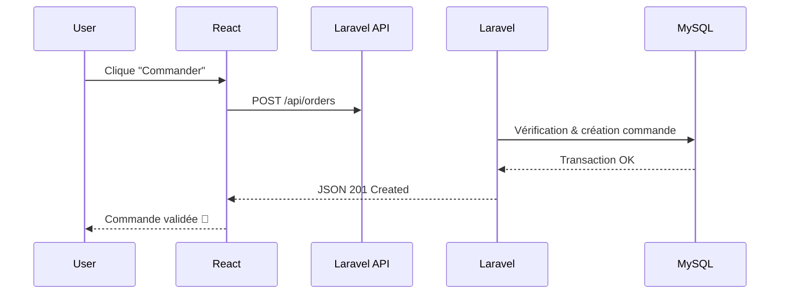

<div align="center">


# ⚡ Electro-05  
### Plateforme E-commerce High-Tech – Architecture Headless


🚀 **Application e-commerce moderne, performante et scalable**  
📱 Vente de produits électroniques (Smartphones, PC, Gaming…)  
🇲🇦 Ciblée pour le marché marocain  

</div>

---

## 🎥 Aperçu & Animation Conceptuelle

<div align="center">

</div>

> Interaction fluide entre **React SPA** et **API Laravel** via JSON sécurisé.

---

## 🧠 Présentation du Projet

**Electro-05** est une plateforme **E-commerce B2C** construite selon une **architecture Headless**.  
Le frontend est totalement découplé du backend, garantissant **performance, sécurité et évolutivité**.

### 🎯 Fonctionnalités principales
- 🛍️ Catalogue produits dynamique
- 🛒 Panier et commandes
- 🔐 Authentification sécurisée
- 📦 Suivi des commandes
- 🧑‍💼 Dashboard Admin (CRUD Produits / Commandes)

---

## 🏗️ Architecture Globale

```mermaid
graph LR
A[Client React SPA] -->|JSON / HTTPS| B[API REST Laravel]
B --> C[(MySQL Database)]
````

📌 **Principe**

* React gère l’UI/UX
* Laravel expose les endpoints API
* MySQL stocke les données métier

---

## ⚙️ Stack Technologique

### 🎨 Frontend

* ⚛️ **React.js 18+** – SPA performante
* 🎨 **Tailwind CSS** – UI moderne & responsive
* 🔁 **Axios** – Communication API
* 🎞️ **Framer Motion / GSAP** – Animations premium

🔗 [https://react.dev](https://react.dev)
🔗 [https://tailwindcss.com](https://tailwindcss.com)

---

### 🔧 Backend

* 🧩 **Laravel 10+** – API REST sécurisée
* 🔐 **Laravel Sanctum** – Authentification SPA
* 🗄️ **MySQL** – Base relationnelle

🔗 [https://laravel.com](https://laravel.com)
🔗 [https://laravel.com/docs/sanctum](https://laravel.com/docs/sanctum)
🔗 [https://dev.mysql.com/doc/](https://dev.mysql.com/doc/)

---

## 🗂️ Structure du Projet

### 📁 Frontend (`Front-end/test/src`)

```txt
src/
├── components/
│   ├── atoms/
│   ├── molecules/
│   └── organisms/
├── context/
├── layouts/
├── pages/
├── services/
└── App.js
```

### 📁 Backend (`05-Electro-Back-end`)

```txt
app/
├── Http/
│   ├── Controllers/
│   └── Middleware/
├── Models/
routes/
└── api.php
database/
├── migrations/
└── seeders/
storage/
```

---

## 🔄 Fonctionnement : Passer une Commande



---

## 🔐 Sécurité & Performance

### Sécurité

* ✅ Tokens Bearer (Sanctum)
* ✅ Middleware Admin
* ✅ Validation stricte des entrées
* ✅ Protection CSRF / XSS native Laravel

### Performance

* ⚡ Lazy Loading React
* ⚡ Eager Loading Laravel
* ⚡ Images WebP optimisées

---

## 📈 Évolutivité

✔️ API réutilisable (Web / Mobile)
✔️ Scalabilité indépendante Front / Back
✔️ Facile à déployer sur serveur cloud

---

## 🚀 Installation Locale (Résumé)

```bash
# Backend
composer install
php artisan migrate --seed
php artisan serve

# Frontend
npm install
npm run dev
```

---

## 👨‍💻 Auteur

**Zakaria Chamekh**
🎓 Développement Web & Applications
💼 Full Stack Junior

📫 *Disponible pour stage / opportunité professionnelle*

---

<div align="center">

✨ *Electro-05 – Build once. Scale everywhere.* ✨

</div>
```

